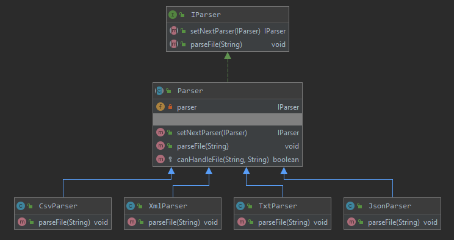

# ДЗ: Паттерн Цепочка обязанностей
Парсер файлов в зависимости от их типа.

Программа, реализующая алгоритм, получает на вход список файлов. И каждый попадает в обработку алгоритма.

На вход алгоритма передаётся ряд файлов, которые имеют различный тип (Xml, JSON, CSV, txt)
Требуется создать цепочку обработки этих файлов, где отдельный обработчик отвечает за обработку конкретного типа документа.

Обработчик логирует получение подходящего ему файла в виде "обработчик TXT получил файл filename.txt" и копирует содержимое в выходной файл.

требуется:
1. создать программу, где на вход подаётся путь файла со списком обрабатываемых файлов и путь выходного файла.
2. реализовать алгоритм обработки с помощью шаблона "Цепочка ответственности"
3. нарисовать диаграмму классов.

# Диаграмма классов
